---

## About Me

I'm a developer with interests in **Artificial Intelligence, Python, and Full Stack Web Development**.

I enjoy building practical software that solves real problems, from AI-powered web applications to responsive management systems. I'm continuously improving my engineering skills by creating production-ready projects and exploring modern development practices.

---

## Tech Stack

<b>Also working with:</b>

Chart.js • Firebase Authentication • Firebase Realtime Database • REST APIs

---

## Featured Projects

<table>
<tr>

<td width="50%" valign="top">

<h3 align="center">InvestoDeck</h3>

<b>AI Investor Pitch Deck Generator</b>

A web application for generating investor pitch decks using Flask, Python and Bootstrap.

 

<b>Technology</b>

* Flask
* Python
* Bootstrap

 

</td>

<td width="50%" valign="top">

<h3 align="center">Nest Hostel Management System</h3>

<b>Hostel Management System</b>

A responsive hostel management application using Firebase Authentication and Firebase Realtime Database.

 

<b>Technology</b>

* Firebase Authentication
* Firebase Realtime Database
* Responsive Web Application

 

</td>

</tr>
</table>

---

## Certifications

<table>
<tr>

<td width="50%" align="center">

<b>AWS Cloud Practitioner Essentials</b>

</td>

<td width="50%" align="center">

<b>Python using AI</b>

</td>

</tr>

<tr>

<td width="50%" align="center">

<b>Deloitte Data Analytics Job Simulation</b>

</td>

<td width="50%" align="center">

<b>Data Science Internship Program</b>

</td>

</tr>
</table>

---

## GitHub Analytics

## Current Focus

* Building better Python applications
* Learning AI Engineering
* Improving Full Stack Development
* Publishing production-ready projects

---

## Contact

---

**Thanks for visiting my profile.**

*Building practical software with Python, AI and modern web technologies.*

